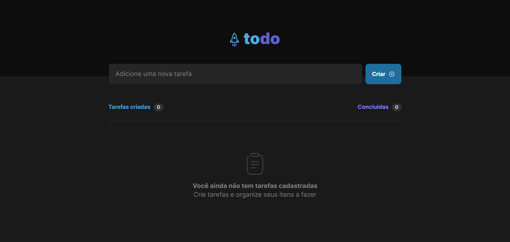

## To-do list Page

Project developed in React.

##
Task management application in **to-do list** style, which contains the following features:
- Add a new task
- Mark and unmark a task as completed
- Remove a task from the listing
Show the progress of task completion

Use concepts such as:

- States
- State immutability
- Lists and keys in ReactJS
= Properties
- Componentization

## Preview

